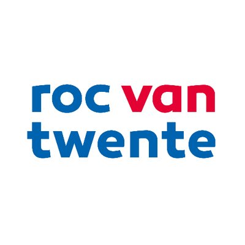

<br />
<p align="center">
  <a href="https://github.com/LucasHuls/ScrumGroep5">
    
  </a>

  <h3 align="center">Scrum Groep 5</h3>

  <p align="center">
    Github of Scrum groep 5
    <br />
    <a href="https://github.com/othneildrew/Best-README-Template"><strong>Explore the docs »</strong></a>
    <br />
    <a href="https://github.com/LucasHuls/ScrumGroep5/issues">Meld een bug</a>
  </p>
</p>

## Project

Calc4You

## Instalatie

1. Clone the repo
```sh
git clone https://github.com/LucasHuls/ScrumGroep5
```

<!-- CONTACT -->
## Contact
Jesse Overveld = 
<br>
Bram van Nek = 
<br>
Sam Elfring = 
<br>
Lucas Huls = 
<br>
Julian Moreno = 
<br>
Project Link: [https://github.com/LucasHuls/ScrumGroep5](https://github.com/LucasHuls/ScrumGroep5)